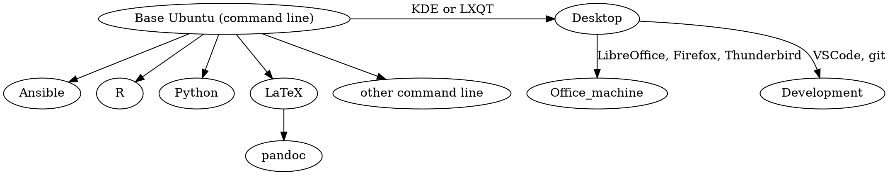

# Different computer roles

```dot {engine=dot}

digraph g {
	node [];
	"Base Ubuntu (command line)" -> Ansible;
    "Base Ubuntu (command line)" -> R;
	"Base Ubuntu (command line)" -> Python;
    "Base Ubuntu (command line)" -> LaTeX;
    "Base Ubuntu (command line)" -> "other command line";
    LaTeX -> pandoc;
    "Base Ubuntu (command line)" -> Desktop [label="KDE or LXQT"];
    Desktop->Office_machine [label="LibreOffice, Firefox, Thunderbird"];
    Desktop->Development [label="VSCode, git"];
    { rank=same; "Base Ubuntu (command line)" Desktop}
}
```
